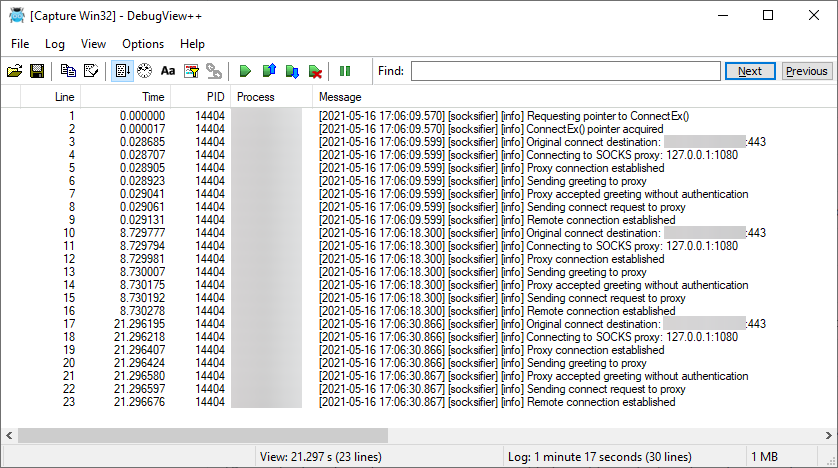
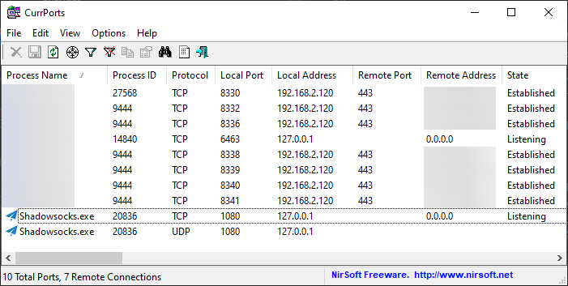

# Socksifier

A Windows DLL which hooks the `connect()` API to redirect sockets to a SOCKS5 proxy server.

 

## Motivation

Over time less and less modern network-enabled applications offer the user with the ability to specify an HTTP or SOCKS proxy server. For this specific need, so called "proxification" applications exist, which are unfortunately scarce and closed-source. This fork is an attempt to provide a modern, *working* and **open** solution for this very specific case.

## How it works

Socksifier is a self-contained DLL with no external dependencies (except the APIs shipped with Windows) that is meant to [get loaded into the process](https://web.archive.org/web/20131012071541/http://blog.opensecurityresearch.com/2013/01/windows-dll-injection-basics.html) who's connections should get "proxified" and achieves this by [API-hooking](https://www.codeproject.com/Articles/2082/API-hooking-revealed) the low-level `connect()` socket function. API-hooking is performed upon library load using the well-known and battle-tested [Microsoft Detours](https://github.com/Microsoft/Detours) library.

After the hook is established, the process's existing connection handles get enumerated and terminated, forcing the network layer of the application to re-establish them, but now calling the hooked `connect`-variant instead.

The detoured function contains the logic necessary to re-route the to-be-established socket connection to a SOCKS5 proxy by performing the necessary protocol-specific handshake and upon success simply returns the socket back to the callee, which is now transparently talking to the proxy instead of the origin destination (e.g. HTTP(S) or WebSocket connection).

## Limitations

This fork has been designed for and tested with [Electron](https://www.electronjs.org/)-based applications and [Shadowsocks](https://shadowsocks.org/) as SOCKS5 proxy **only**. Other use-cases might work but are left to the reader to discover by experimentation.

## Disclaimer

This project makes heavy use of code and mechanisms unfortunately widely (ab)used by malware (loading foreign code into processes, manipulating handles and network traffic flow), therefore might trigger anti-virus/anti-cheat solutions. Make sure to add an exclusion to your AV in case this becomes and issue and *refrain* from injecting into anti-cheat protected games as this *might* pose the risk of a false-positive ban. You have been warned ❤️

**The reader is highly encouraged to study the code and build the project by themselves** instead of trusting the provided binaries.

## Build

[Follow the Vcpkg Quick Start](https://github.com/Microsoft/vcpkg#quick-start) and install the following packages:

- `.\vcpkg install spdlog:x86-windows-static spdlog:x64-windows-static detours:x86-windows-static detours:x64-windows-static`

## Getting started

You can get pre-built binaries (x86, x64) [at the release page](../../releases/latest).

To enable the redirection you just have to inject the DLL into your target process. Either use a [DLL injector tool](https://github.com/nefarius/Injector) or make injection persistent across application launches with additional help from [LoadDLLViaAppInit](https://blog.didierstevens.com/2009/12/23/loaddllviaappinit/) or similar tools (IAT patching and alike).

Optionally set up the following environment variables to configure the DLL. Default values are used if omitted.

- `SOCKSIFIER_ADDRESS` - IP address of the SOCKS5 proxy to connect to (defaults to `127.0.0.1`)
- `SOCKSIFIER_PORT` - Port of the SOCKS5 proxy to connect to (defaults to `1080`)

The default values assume that a [Shadowsocks client](https://github.com/shadowsocks/shadowsocks-windows) is running and listening on localhost.

## Diagnostics

The library logs to the Windows Debugger Backend and can be observed with [DebugView++](https://github.com/CobaltFusion/DebugViewPP) or similar.

## Example

Observe the change in network connections with e.g. [NirSoft CurrPorts](https://www.nirsoft.net/utils/cports.html).

### Before

### After

## Sources

- [Windows Sockets Error Codes](https://docs.microsoft.com/en-us/windows/win32/winsock/windows-sockets-error-codes-2)
- [WSAEWOULDBLOCK error on non-blocking Connect()](https://stackoverflow.com/questions/14016579/wsaewouldblock-error-on-non-blocking-connect)
- [ConnectEx function](https://docs.microsoft.com/en-gb/windows/win32/api/mswsock/nc-mswsock-lpfn_connectex)
- [connect function](https://docs.microsoft.com/en-us/windows/win32/api/winsock2/nf-winsock2-connect)
- [WSAGetOverlappedResult function](https://docs.microsoft.com/en-gb/windows/win32/api/winsock2/nf-winsock2-wsagetoverlappedresult)
- [Working ConnectEx example](https://gist.github.com/joeyadams/4158972)
- [Simple SOCKS5 client written in C++](https://github.com/rudolfovich/socks5-client)
- [WSock Socks5 proxy forwarding POC](https://github.com/duketwo/WinsockConnectHookSocks5)
- [SOCKS Protocol Version 5](https://tools.ietf.org/html/rfc1928)
- [shadowsocks-windows](https://github.com/shadowsocks/shadowsocks-windows)
- [Sysinternals - Enumerate socket handles](https://web.archive.org/web/20120525235842/http://forum.sysinternals.com/socket-handles_topic1193.html)
- [Get name of all handles in current process](https://stackoverflow.com/q/8719252/490629)
- [Get a list of Handles of a process](https://www.cplusplus.com/forum/windows/95774/)
- [Hijacking connections without injections: a ShadowMoving approach to the art of pivoting](https://adepts.of0x.cc/shadowmove-hijack-socket/)
- [Lateral Movement by Duplicating Existing Sockets](https://www.ired.team/offensive-security/lateral-movement/shadowmove-lateral-movement-by-stealing-duplicating-existing-connected-sockets)
- [SYSTEM_HANDLE_TABLE_ENTRY_INFO](https://www.geoffchappell.com/studies/windows/km/ntoskrnl/api/ex/sysinfo/handle_table_entry.htm?ts=0,115)
- [Get Handle of Open Sockets of a Program](https://stackoverflow.com/q/16262114/490629)
